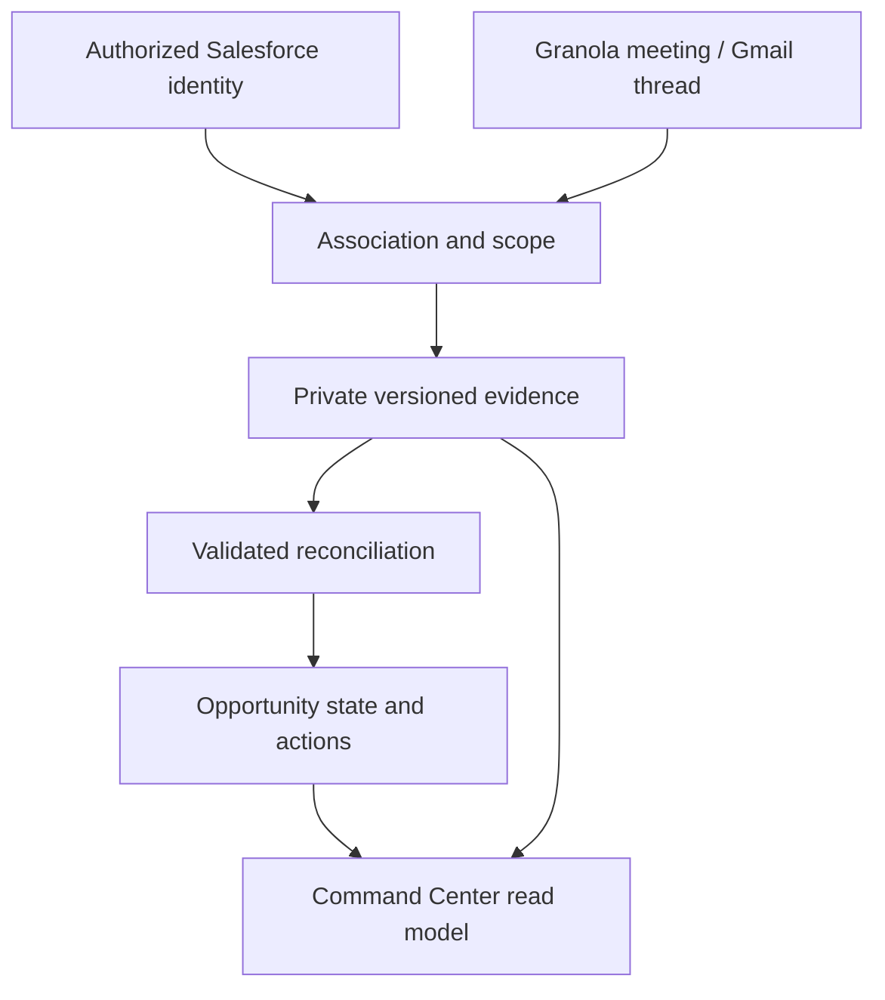

# Command Center — Product and Architecture Specification

**Status:** Proposed for product and engineering review  
**Baseline:** `Airbyte-Solutions-Team/se-skills` `main` at `60fc7081e294662e6713c183d1afe69b270da420`, inspected September 24, 2026  
**Scope:** Product behavior, source boundaries, reconciliation, read models, and an implementation sequence. This document changes no runtime behavior and does not authorize live customer-data ingestion, new credentials or providers, deployment, or Salesforce write-back.

## 1. Product outcome

Command Center is the portfolio view above Opportunity Overview. It helps an SE or AE answer, across the active opportunities they can access:

1. What needs my attention today, and why?
2. What do I, Airbyte, the customer, or another team owe next?
3. What changed since I last checked?
4. Which opportunities have new evidence, and which views may be stale?
5. Where do I open the underlying evidence or the full Opportunity Overview?

The intended experience is that authorized customer meetings and relevant email threads become evidence without an SE repeatedly uploading or copying text. The application reconciles that evidence into an attributable operational state. The user can correct associations and judgments and complete work. **A dashboard is useful only when the evidence pipeline and its failures are visible.**

The four surfaces are **Today**, **Portfolio**, **Actions**, and **Changes**. They consume the same opportunity state, action records, source status, and authorization rules. Command Center is an aggregate read model; it does not run connectors or mutate canonical state while rendering a page.

### Release boundary

This is a proposed expansion beyond the documented hosted beta, whose first hosted skill is `post-call` on an uploaded transcript. The local Opportunity Overview already has typed revisions and What Changed, but it does not have continuous external ingestion. A local pilot may establish the user experience; a hosted rollout needs its own authorization, persistence, worker, and integration review. The spec does not turn local `sf` CLI auth or arbitrary local MCP tools into hosted capabilities.

## 2. Repository facts and design implications

| Current implementation at the baseline | Implication for Command Center |
|---|---|
| [`webapp/services/opportunity_workspace_service.py`](../webapp/services/opportunity_workspace_service.py) aggregates one local opportunity's metadata, state, outputs, jobs, and freshness. | Reuse its opportunity-level contract and links; create a separate portfolio read service. |
| [`webapp/opportunity_state.py`](../webapp/opportunity_state.py) restricts evidence references to `transcript` and `opportunity_metadata`; its `recommended_actions` are bounded items inside a versioned AI state. | Extend the source contract deliberately. Build a durable action lifecycle instead of treating a recommendation inside a regenerated version as a completed task. Preserve migration behavior for older revisions. |
| [`webapp/services/opportunity_state_service.py`](../webapp/services/opportunity_state_service.py) stores immutable local versions and a current pointer; the Overview computes typed changes. | Keep validated versions and stale-base protection. Persist human action transitions separately; derive meaningful change entries from typed transitions. |
| [`webapp/integrations/salesforce.py`](../webapp/integrations/salesforce.py) uses the authenticated local `sf` CLI. It returns opportunity/account IDs and selected opportunity fields. It does not currently query contacts or account email domains; some account-oriented methods select one opportunity per account. | Stable Salesforce IDs can help identity mapping, but a new bounded contact/domain read path and hosted authorization adapter need separate work. Never infer that the one selected row represents every active opportunity. |
| [`webapp/pov_gsheet_context.py`](../webapp/pov_gsheet_context.py) has an `ExternalEvidence` contract for a different skill; [`webapp/pov_gsheet_bridge.py`](../webapp/pov_gsheet_bridge.py) normalizes raw Salesforce and Gong, while Granola/Gmail inputs are already-normalized. | Reuse the concepts of source identity, coverage, conflict, and direct-customer attribution. Do not use that script or its `raw` field as the production evidence store or assume Granola/Gmail ingestion works. |
| [`webapp/services/overview_service.py`](../webapp/services/overview_service.py) powers the existing team landing overview. Hosted accounts, transcripts, jobs, outputs, and review use organization ownership and private storage. | Keep Command Center's portfolio read model distinct. Any hosted tables and routes require application authorization, RLS, same-org relationships, and private source storage. |

The existing [`docs/OPPORTUNITY_OVERVIEW.md`](OPPORTUNITY_OVERVIEW.md) establishes evidence before canonical state, immutable versions, source manifests, deterministic What Changed, and human-confirmed precedence. This spec extends those rules across opportunities and adds independent operational objects and connector health. It does not authorize reading generated Markdown back into state.

## 3. Source responsibilities and authority

| Source | What it can establish | What it cannot establish by itself |
|---|---|---|
| Salesforce | Stable Account/Opportunity identifiers, CRM stage, CRM owner, CRM dates, known contact and domain mappings **when actually retrieved**. | That a meeting or email belongs to a particular opportunity; that a CRM assertion is current customer truth; a technical win. |
| Granola | Authorized meeting ID, occurrence time, title, attendees, notes, and transcript **when accessible**. A transcript supports attribution of statements and commitments. | That a meeting was matched correctly; that a proposed risk is confirmed; that the transcript is available immediately or for every plan/user/workspace. |
| Gmail | Authorized thread/message ID, participants, date, subject, and in-scope body content after filtering. It can support a new request, response, or completion suggestion. | That a vague subject identifies an opportunity; that an attachment was processed when only its mention was read; that a sent message proves the recipient acted. |
| Manual SE input | Confirmed association, corrected field, action completion, dismissal, and review decision, all attributable to an actor. | An excuse to overwrite the original source or remove the history of an AI suggestion. |
| SE Skills outputs | Links to validated and reviewed artifacts, with their own provenance and freshness. | Canonical evidence merely because an output is newer. Promotion of a reviewed fact requires an explicit operation. |

CRM wins for its own CRM metadata fields; a conflicting customer statement produces a visible **CRM out-of-sync** signal rather than writing to Salesforce or silently changing the CRM field. For operational conclusions, a current human confirmation outranks an extracted claim; raw attributable customer evidence outranks unsupported inference. Product capability claims still require verified product/reference evidence. Conflicts remain inspectable with their source and date.

## 4. Data flow and trust boundaries

The source adapter fetches with a narrowly scoped user or approved organization connection, verifies authorization, bounds input, and records source version and access scope. Association is a separate operation with a saved reason and an ambiguity state. An ingestion job writes the private evidence record before extraction. A trusted validator checks claims and evidence references before a candidate can update opportunity state. The read API queries stored results; page loads do not contact Granola, Gmail, or Salesforce directly.

Trust boundaries are **external provider → authenticated connector → private storage/ledger → isolated analysis runtime → trusted validator/promoter → authorized API → browser**. Provider responses, transcripts, email bodies, attendees, subjects, and model output are untrusted inputs. The browser supplies neither organization ownership nor a raw storage path. Connector credentials stay outside the sandbox, the browser, job payloads, and logs. Only approved source material enters an isolated analysis attempt; external text is treated as evidence, never as instructions or tool arguments.

### Evidence and processing ledger (proposed contract)

Use a tenant-owned source object and immutable content revisions, with fields or equivalent relationships for:

- `org_id`; source and connection identity; source workspace/mailbox identity and access scope; provider object ID; revision/hash; occurred, observed, and retrieved times.
- Source kind (`crm_snapshot`, `meeting`, `email_message`, `manual_transcript`); content availability (`metadata_only`, `content_available`, `access_lost`, `deleted`, `failed`); private object reference and bounded retrieval metadata.
- Original account/opportunity association, its method (`explicit`, `verified_external_id`, `thread_mapping`, `contact`, `domain`, `title`, `manual`), candidate set, decision actor, and correction history.
- Processing status (`discovered`, `awaiting_association`, `awaiting_content`, `queued`, `processing`, `processed`, `failed`, `superseded`); attempts, retry eligibility, last error category, and processed source revision.
- Scope and lineage for every extracted observation: evidence ID + revision + locator, extractor version, model/runtime, confidence, validation result, and whether it was applied, proposed, dismissed, or superseded.

These are design fields, not table names. Raw transcripts and selected email bodies live only in private source storage, separate from state JSON, logs, audit metadata, and the global list response. Enforce bounded size and retention/deletion rules consistent with the source and hosted transcript policy. A revoked connection or deleted source must make the source unavailable and trigger policy-driven reconciliation; a stale cached copy must not be represented as currently accessible. Define a separately reviewed retention and deletion policy before ingestion with real customer content.

Use a unique key at least on `(org, provider, connection/workspace, source object ID, content revision)`. Polls, webhook retries, and job restarts can rediscover the same item safely. A changed note/message creates a new evidence revision and a new reconciliation candidate, never a silent overwrite. Multiple users may expose the same meeting through different grants; record both provenance paths and avoid duplicating its operational actions after a verified match. Do not merge two different provider objects solely because their titles and times resemble each other.

### Access scope matters

Granola can return a user's personal or shared notes, and Gmail can return private mail. The fact that one SE may read a source does **not** automatically grant every organization member permission to read its content in Command Center. Before ingestion, establish the product policy for consent and redistribution into org-owned opportunity state: either restrict the derived view to authorized viewers or require a source sharing policy/explicit confirmation for promotion. A list row may show a permitted status without revealing subject, attendee, body, or sensitive conclusion to a user who lacks source rights. This is a release gate, not a UI detail.

## 5. Account and opportunity association

Resolve the account first, then the opportunity. Preserve the evidence even when it cannot yet be associated, but do not update an opportunity until its association is authorized and recorded.

1. Prefer an existing explicit mapping of provider object/thread to a stable opportunity ID, or a verified Salesforce/SE Skills external ID. A prior mapping can be corrected, including its earlier derived changes.
2. Match a known contact address to its Salesforce account when the lookup actually includes that contact. Domain matching is a candidate signal only: shared domains, consultants, partners, free mail providers, aliases, and multiple accounts can make it ambiguous.
3. Use subject/title, attendee overlap, prior meetings, and the set of active opportunities as supporting signals. A single active opportunity may strengthen a proposal; it is not blanket authority to attach unrelated content.
4. If exactly one candidate meets a defined, testable automatic threshold, save the decision with its signals and an **Undo/change opportunity** control. If several remain plausible, show a small association queue and do not run opportunity reconciliation.
5. An email thread already confirmed for an opportunity supplies a stable mapping to later messages, unless participants or subject materially change, the thread is split, or a user corrects it. A later message still needs source scope and relevance checks.

Do not use organization-wide fuzzy name search as an authorization mechanism. Do not create a new account/opportunity or change a Salesforce relationship merely because a model guessed. Exclude internal-only meetings, newsletters, automated mail, and unrelated content unless explicitly opted in. Preserve an **unassociated** state and a manual transcript path when sources are missing.

## 6. Reconciliation and operational objects

### Opportunity state

Continue to use typed, immutable Opportunity Overview revisions for brief, qualification, business case, MEDDPICC, stakeholders, technical evaluation, and source manifest. The Command Center consumes only fields that have a validated read contract. It does not need those detailed sections as portfolio columns.

For each newly authorized source revision, compare extracted observations with the effective current state and independent operational records. A candidate carries its source references and base version. Validation checks same-organization/same-opportunity references, schema, bounds, duplicate keys, source availability, and human-confirmed precedence. Promotion uses a compare-and-swap or locked current pointer. On failure, timeout, cancellation, or stale base, leave the prior state intact and show the source as pending/failed; retry with the same source and base is safe. Never report processing success merely because a connector fetched bytes.

### Actions are durable work, not recommendations

Introduce a first-class action record or equivalent event-backed domain object. `recommended_actions` in the current overview remain suggestions and must not be silently promoted, duplicated, or treated as completed commitments.

An action has a stable ID, organization/account/opportunity, concise commitment and definition of done, responsible party (`Airbyte`, `Customer`, `Engineering`, `Security`, `Partner`, or `Unknown`), named owner when known, due date with source timezone/interpretation when known, status (`proposed`, `open`, `blocked`, `completed`, `dismissed`), origin and subsequent evidence references, and an append-only transition history with actor/reason. Unknown dates and owners stay unknown. A customer saying “we'll send logs Friday” may create an open action with an explicit party/date when unambiguous; “we should look at logs” stays a proposal. User completion is an attributable event, and reopening must be explicit.

A later email or call may propose that an existing action is complete, changed, or blocked. Match on opportunity, subject, responsible party, and context; present candidate duplicates for review rather than recreating them. Do not mark a commitment complete solely because a message mentions it. If the user confirms completion, record both the suggesting source and confirming actor. A dismissed action is not recreated automatically from the same evidence revision.

### Questions, blockers, risks, waiting on

- **Technical question:** stable question, owner/party, open or answered state, answer evidence, and resolution history. A customer email may suggest an answer; product capability answers require independent verification.
- **Blocker:** a confirmed impediment with owner, clearing condition, severity, evidence, and status. A potential blocker from a call is a review candidate, not an automatic red banner.
- **Risk:** evidence-backed possibility with impact, mitigation, and review state. Missing information is a gap, not automatically a risk. Do not infer a generic deal-health score.
- **Waiting on:** derived from outstanding actions, questions, and blockers, with one or more responsible parties and linked reasons. `none` means no known outstanding dependency; `unknown` means the evidence is insufficient. Do not collapse simultaneous customer and Engineering dependencies into one guessed label.

Meaningful change entries are deterministic diffs of accepted typed state and operational transitions. Each has opportunity, before/after, change type, source revision, confirmation actor if any, occurred/applied times, and a link to detail. AI may phrase a validated change for readability; it cannot invent the change. Source discovery and job retries belong in the processing queue, not the main Changes feed unless they affect user trust.

### Applying and reviewing changes

| Change | Default handling |
|---|---|
| Verified meeting occurrence/participants and source receipt | Apply as scoped evidence metadata. |
| Explicit, unambiguous new action or question with source reference | Add with visible edit/undo; keep unknown owner/date unknown. |
| Possible fulfillment, duplicate, owner ambiguity, relative date, or conflicting source | Propose a correction for review. |
| Blocker, material risk, POV timeline change, CRM discrepancy, or human-confirmed value conflict | Require explicit confirmation before effective state changes. |
| Unsupported inference or invalid evidence citation | Reject and show a processing/review reason. |

This is a policy target. The first implementation may require review for more cases until extraction quality is measured. Review prompts are grouped per source and opportunity so one call does not create a mandatory field-by-field checklist. Every applied AI-derived change has a correction path, and human decisions survive future reprocessing.

## 7. Freshness, reliability, and cost

Freshness is **per source and opportunity**, not one `last updated` timestamp. Track last successful source check/event, most recent source object seen, association status, content retrieval, latest processed revision, state revision derived from it, and current connector health. Display, for example:

- `Current through Granola meeting · Sep 24, 10:06 AM` only when the most recent *observed and accessible* relevant meeting was matched and processed and the connection check is recent enough for the configured cadence.
- `A Granola meeting needs opportunity association` or `New email awaiting review` when discovered but not applied.
- `Granola disconnected · freshness unknown` or `Gmail check failed · last successful check Sep 22` when a healthy latest-source claim cannot be made.
- `Overview predates 2 processed sources` for a generated artifact whose manifest lacks them.

“No changes” is valid only after a successful check with no new relevant sources, within the check window. A failed poll, disabled webhook, missing transcript, rate limit, lost authorization, inaccessible workspace, backlog, or failed analysis must be visible as **unknown/incomplete**. Show an Unprocessed Sources queue with retry and association controls, while Today gets one concise attention item for material ingestion failures rather than dozens of retries. Define backfill window, overlap, reconciliation cadence, and privacy/cost limits before enabling automatic processing. Enforce bounded lookback, pagination, backoff, attempt caps with recoverable dead-letter state, per-source rate limits, model cost ceiling, and explicit usage/cost metadata. Manual retries must be idempotent.

## 8. Command Center information architecture

The default page is **Today**. Every attention card gives a concrete reason, linked opportunity, source/status, and next action. A rule-based order can prioritize overdue Airbyte commitments, confirmed blockers, due commitments, unresolved review items, waiting-on-customer follow-ups, and ingestion gaps. Users can inspect the reason; there is no opaque priority score.

| View | MVP content | Main interaction |
|---|---|---|
| **Today** | Due/overdue commitments, confirmed blockers, important review requests, material source failures, and recent meaningful changes. | Complete or review action; open opportunity; dismiss/snooze attention without deleting evidence. |
| **Portfolio** | Authorized active opportunities; stage from CRM if present; current next step; waiting-on parties; evaluation state; open action count; latest known interaction; freshness and attention reasons. | Filter by assignment/status; open Opportunity Overview. |
| **Actions** | Global durable queue grouped by responsible party, owner, due date, and status. | Complete, edit, reopen, dismiss, and inspect origin/history. |
| **Changes** | Accepted semantic changes and pending consequential changes with before/after and provenance. | Review a proposal, correct it, or inspect the source if authorized. |

Show an honest empty state if there is no authorized data. The portfolio must not show fifteen MEDDPICC columns, raw transcripts, unrestricted mail, a synthetic 0–100 health score, or a noisy job-event feed. Limit/paginate lists and provide keyboard and narrow-screen behavior. Access to a portfolio row does not imply permission to open every underlying private source.

**Upcoming meetings and prep readiness require an actual future-meeting source** (a separately approved Calendar integration or verified equivalent). Past Granola notes do not supply a reliable calendar. The initial Today release must not invent a meetings-today section.

## 9. Connector feasibility and release gates

### Granola first

Granola's [current MCP documentation](https://docs.granola.ai/help-center/sharing/integrations/mcp) lists `get_account_info`, `list_meetings`, `get_meetings`, and paid-plan `get_meeting_transcript`. MCP uses an individual user's browser OAuth, follows that user's active workspace, and is subject to plan and workspace access. Granola explicitly describes its [API](https://docs.granola.ai/help-center/sharing/integrations/granola-api) as the route for scripts/automation; its [webhooks](https://docs.granola.ai/webhooks) notify on note generation, edits, and access grants, then require an API fetch. MCP connection in ChatGPT or Claude does **not** hand SE Skills a hosted background credential or webhook.

Start with an MCP capability check using a dedicated authorized test workspace/account: establish account/workspace identity, list recent notes with stable IDs and pagination, fetch notes and transcripts, inspect timing, revisions/edits, rate limits, consent, and whether an unattended job can refresh a per-user grant reliably. Record actual tool schemas/responses and failure modes. Do not promise automatic “meeting ended → new transcript” timing until observed. If MCP cannot satisfy background discovery securely, recommend an **explicit product decision** to use Granola API/webhooks for continuous ingestion while retaining MCP for interactive lookup; that choice changes credential and webhook scope and needs approval. Never silently switch provider path or rely on a ChatGPT-only connection as the application integration.

### Salesforce identity

Initially read Account/Opportunity IDs and a bounded set of CRM fields from an authorized connection; extend to Contacts/email domains only after verifying field availability and privacy. Maintain a mapping of external IDs to internal organization-owned objects. A temporary manual association path allows a Granola pilot without Salesforce, including when the local CLI is offline. Hosted Salesforce OAuth, credential custody, and schedules are separate from the existing local `sf` adapter. No Salesforce write-back in this scope.

### Gmail after the first meeting loop

Read-only, per-user consent and the smallest scopes/fields that meet the task are prerequisites. Discover candidate threads from known contacts, domains, confirmed threads, and bounded dates; metadata can suggest relevance, but access to message bodies requires an approved match/filter and a purpose. Store only selected relevant messages with a retention policy, not a mirror of the inbox. Implement thread mapping, changed-message deduplication, sender/recipient verification, revocation, and ambiguity review. Do not process attachments or infer they were received from a sentence mentioning them. Prove consent, scope, quota, and host credentials before enabling background scans. Gmail is part of the planned architecture but is not a prerequisite for the first useful Granola-backed Command Center.

### Calendar later

Add upcoming meetings, attendee matching, and prep readiness only after the core evidence/action loop works and future calendar authorization is approved. Email ingestion, CRM identity, and calendar events have different authority; one cannot stand in for the other.

## 10. Implementation sequence and review boundaries

Prefer coherent vertical work with one new trust boundary per PR, rather than a chain of presentation-only slices. Each implementation PR reports its exact head, producer-to-consumer flow, security boundaries, real-tool evidence versus fakes, tests, deferred live checks, and a fresh review of the full diff.

### PR A — This specification

Documentation only. Review the source and sharing policy, Granola transport gate, action lifecycle, and first usable UX. No new connector, credential, data migration, or UI behavior.

### PR B — Identity and Granola evidence intake

Implement the source ledger, authorized identity mapping, deterministic association, private versioned evidence, and one Granola adapter **after** the capability check settles MCP versus API/webhooks. Provide local/manual fallback and an unprocessed-source status API. Extend Salesforce reads only as needed for stable IDs and verified contacts/domains. Validate same-org ownership, access scope, provider payloads, duplicates, revisions, retries, disconnection, and source deletion with synthetic fixtures and realistic provider fakes. Live authorized test-workspace verification is a separate gate before calling discovery operational.

### PR C — Reconciliation and action lifecycle

Extend the existing state/evidence contract for verified sources; introduce durable actions, questions, blockers, review proposals, human transitions, and deterministic changes. Complete one end-to-end Granola meeting → associated evidence → validated observations → state/action update → correction/undo flow. Keep prior state if any stage fails. Test stale bases, simultaneous calls, conflicting evidence, replay, deduplication, completion suggestions, and human precedence. Do not mark it production-ready on mocked LLM behavior alone; compare source coverage and unsupported-claim behavior with representative local post-call analysis.

### PR D — Command Center read API and UI

Build Today, Portfolio, Actions, and Changes from authorized persisted state, with filters, provenance links, freshness, attention reasons, and the unprocessed-source queue. No provider call or model invocation in page rendering. Prove account/opportunity scope, access-restricted source display, pagination, desktop/mobile and keyboard use, no-data and connector-failure states, and navigation to Opportunity Overview. A first user pilot can be Granola + Salesforce/manual identity without Gmail.

### PR E — Gmail evidence intake

Add bounded read-only discovery and thread mapping through the same ledger and reconciliation path. Show an email suggesting an existing action's completion or a new ask, with user confirmation where required. Test unrelated mail exclusion, ambiguous domains, cross-account threads, reply chains, duplicates, revocation, and no-body/no-attachment cases. Add Calendar later under its own product/security review.

If PR B's live capability gate or source-sharing policy cannot be satisfied, keep it draft and still allow schema/fixture research; do not claim an operational continuous-ingestion feature.

## 11. Acceptance criteria for the first usable release (PRs B–D)

1. One authorized user can connect an approved Granola route, discover an accessible new meeting, retrieve the available transcript, associate it to the correct organization-owned opportunity, and see its immutable evidence revision and processing status. If transcript access is unavailable, the app says so and retains manual upload.
2. Repeated discovery, reordered/retried events, and process restart do not produce duplicate evidence versions, actions, or accepted changes. Edited notes yield a new source revision and a controlled reconciliation.
3. Two active opportunities for one account remain distinguishable. Ambiguous meetings wait for association; a corrected association retracts or supersedes prior derived state without deleting history or leaking evidence.
4. An explicit commitment creates a source-linked action; an ambiguous commitment awaits review. A later source can suggest its completion, but the action remains open until the intended policy or an attributable user transition resolves it.
5. A confirmed blocker and an overdue action appear with explainable reasons in Today. Portfolio and Changes reflect the same state. Completing an action updates all three without a page-specific copy of truth.
6. The UI distinguishes `processed latest observed source`, `source pending`, `failed/disconnected`, and `not checked recently`; it never asserts globally complete knowledge from an unhealthy connector.
7. The source, extraction, human decision, and effective state are separately reconstructable. Original transcripts and email bodies are absent from state JSON, list responses, audit metadata, logs, and fixtures.
8. Wrong organization, account, opportunity, source grant, and connection cannot read or mutate an item at API and database boundaries; source-sharing and correction policies are enforced. Private storage cannot be read by another organization or an unauthorized member.
9. A failed, invalid, cancelled, or stale-base analysis leaves the previous current state intact, exposes a safe retry state, and does not complete an action. All applied changes cite authorized source revisions.
10. The hosted worker retains its current isolation and post-call skill allowlist. External connector credentials and direct provider network access are excluded from the sandbox; a separately reviewed trusted connector process owns those capabilities.

Validation must include real connector behavior in an authorized test workspace, realistic documented failure shapes, adversarial malformed/oversized input, replay and concurrent updates, organization and source-grant isolation, and end-to-end navigation. Synthetic fixtures only; real customer data requires its own approved handling. Report evidence from live tools separately from fake/structural tests.

## 12. Decisions to resolve before code or launch

| Decision | Recommendation and gate |
|---|---|
| Where to pilot | Local single-user pilot for UX and extraction, then hosted org-aware implementation only after its scope and cost are approved. Do not transplant local filesystem or `sf`/Claude Code credentials into hosted mode. |
| Granola transport | Verify MCP in an authorized test account first as requested. Prefer the documented API/webhook route for unattended continuous sync if MCP sessions cannot safely sustain it; seek explicit approval for that switch and its credential scope. |
| Granola/Gmail redistribution | Decide which personally accessible sources may be promoted into organization-visible state, who may see derived details, and what happens when access is revoked. No live ingestion before this policy is enforced. |
| Salesforce source of record | Read-only Account/Opportunity identity and selected CRM fields initially. Define conflict display without CRM writes; verify available Contacts/domains before using them for automatic matching. |
| Gmail timing | Follow the first working meeting-to-action loop, then add a scoped per-user mailbox integration; do not make Gmail a prerequisite for the initial Today page. |
| Retention and cost | Approve source retention/deletion, backfill bounds, polling/webhook choice, analysis limits, quotas, and credential storage before an always-on hosted connector. |

## 13. Source references

- Repository implementation and scope: [`docs/OPPORTUNITY_OVERVIEW.md`](OPPORTUNITY_OVERVIEW.md), [`docs/PRODUCT.md`](PRODUCT.md), [`docs/ARCHITECTURE.md`](ARCHITECTURE.md), [`docs/SECURITY.md`](SECURITY.md), [`docs/DATA_MODEL.md`](DATA_MODEL.md), and the code linked in section 2, all inspected at the pinned baseline.
- External capability documents checked September 24, 2026: [Granola MCP](https://docs.granola.ai/help-center/sharing/integrations/mcp), [Granola API](https://docs.granola.ai/help-center/sharing/integrations/granola-api), and [Granola Webhooks](https://docs.granola.ai/webhooks). Documented capabilities are not evidence that the user's workspace or this application already has a working connection.
